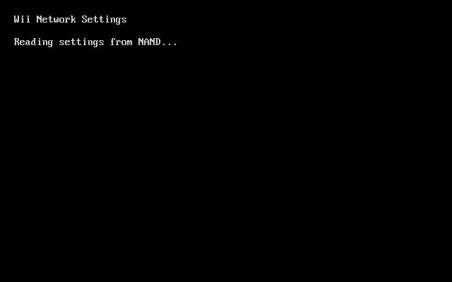

# Wii Network Settings Homebrew

Wii homebrew for editing network connection profiles. For systems where you can't (or don't want to) use the System Menu.

## Installing

Download the [latest release](https://github.com/loopj/wii-network-settings/releases/latest) and unzip it, then Copy the `apps` folder to the root of your USB drive / SD card.

## Controls

Works with both Wii Remotes and GameCube controllers.

| Action                | Wii Remote | GameCube        |
| --------------------- | ---------- | --------------- |
| Move                  | D-pad      | D-pad or stick  |
| Select or type        | A          | A               |
| Back or delete        | B          | B               |
| Finish typing         | Plus       | Start           |
| Shift                 | Minus      | Y               |
| Cancel typing or exit | Home       | Z               |

## Building

Install devkitPPC and libogc, then run `make` with `DEVKITPPC` set.

Running `make dist` will build a Homebrew Channel folder under `dist/apps/wii-network-settings` with `boot.dol`, `meta.xml` and `icon.png`.
